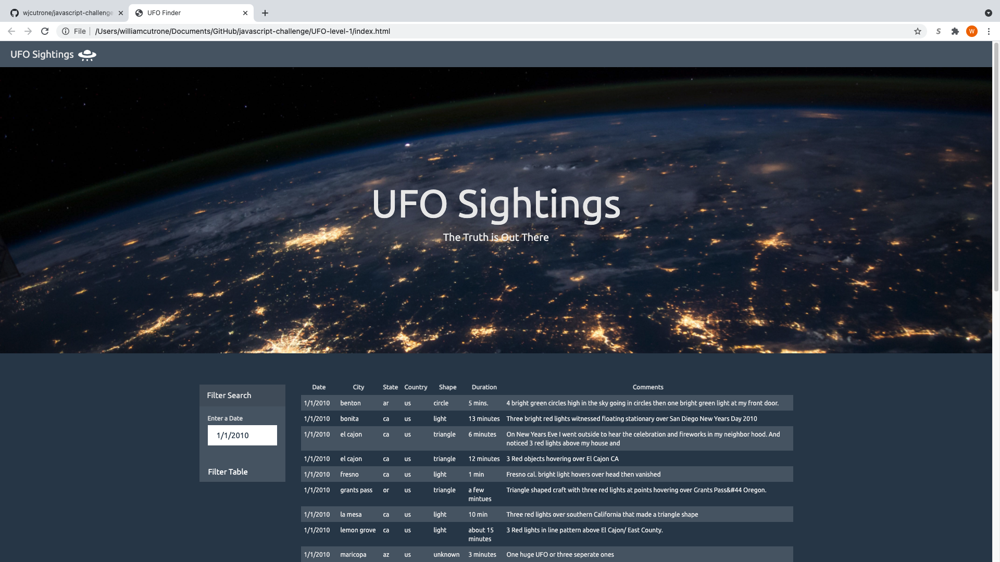
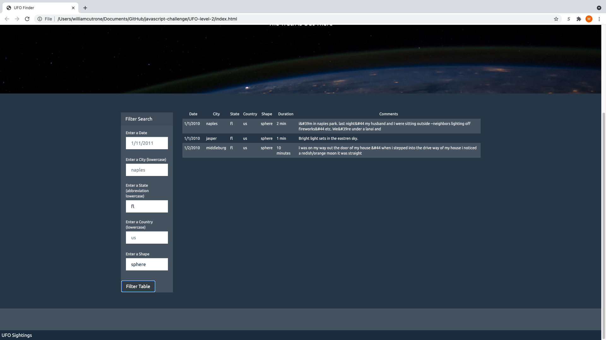

# Alien Eye Witness Reports
The objective of this repository is to dynamically create a table on a webpage from a very large dataset that a user can manipulate. The raw dataset is too large to search through manually and would be very incovienient for users to search through in order to find desired data about UFO sightings. Therefore, the goal is to create a organized table that users can filter to get table data for specific values. This will be accomplished using HTML, CSS, JavaScript and D3.js.

The repository contains two directories, one called UFO-level-1, and one called UFO-level-2. In UFO-level-1, the objective is to modify a webapp so that a user can filter all the UFO data based on date, and see data about instances for a specific date. The first thing the user will see in this folder is the "index.html" file, which contains the code to make the webapp appear. The other element in this directory is the static folder, which will allow users to access the css and the javascript files that are needed to make the webapp interactive. The raw data is located in a file called data.js, which is in json format. One can navigate to this file by entering the static folder, and then the js folder. Inside the static folder is also a folder for the css code and an images folder for an image needed for html code. In order to succesfully carry out the objective of filtering data by date, one simply has to open the index.html file and enter a date in the form box which directs one to enter a date. A example of the filtering capability can be seen below.

The second directory, UFO-level-2, contains code for a webapp that performs a similar function. However, instead of just accepting one filter, there are now five different filters that users can filter data by. The user also has the choice of applying just one filter or applying any combination of the 5 different filters. An example of this version of the webapp being deployed can be seen below. In the below example, two different filters are being successfully applied at the same time, the state of Flordia and shape of a sphere.

